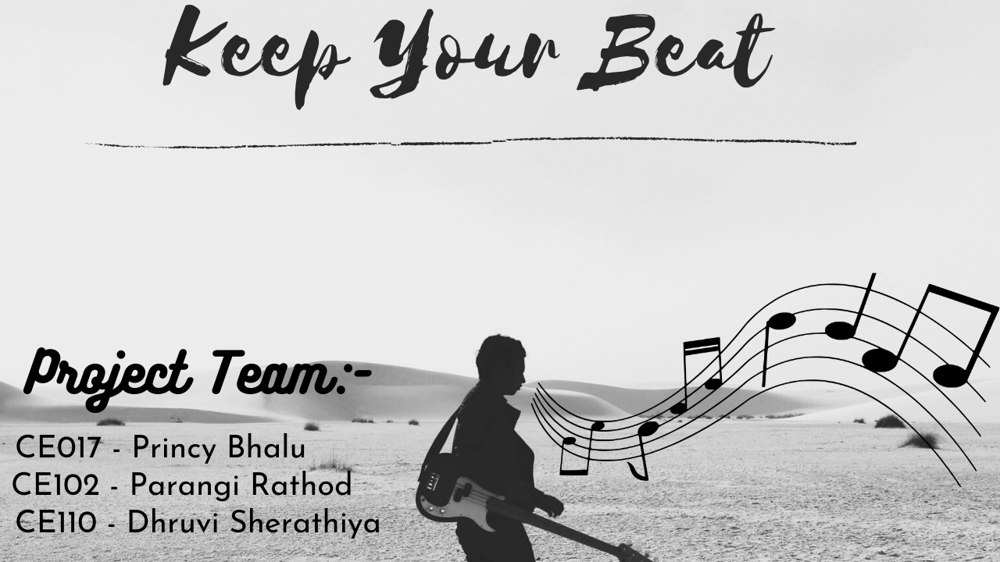

# ICTWIIb_Project_CE017_CE102_CE110

### Project Definition : Online Music Site 

### Language Used      : HTML, CSS, JavaScript, PHP

### Database Used      : MySQL

## Project Functionalities:
### 1. USER
- Listen Songs
- Save liked song
- Download song
- Edit Username
- Upload Profile Picture
- Delete Account
- Upgrade to Artist
### 2. ARTIST
- Upload Songs
- See number of likes on his/her song
### 3. ADMIN
- View user and artist profile
- Delete user and artist profile
- See number of likes on any songs
## Project Made By:

 [CE017 - Princy Bhalu](https://github.com/princybhalu)
 
 [CE102 - Parangi Rathod](https://github.com/Parangi-27)
 
 [CE110 - Dhruvi Sherathiya](https://github.com/DhruviSherathiya).

## Project Explanation Video Link:

[Watch Demo Video Here](https://drive.google.com/file/d/1OcfFVBXOYdG6AjsH5qzRIg7ff5MuEW0X/view?usp=sharing)

